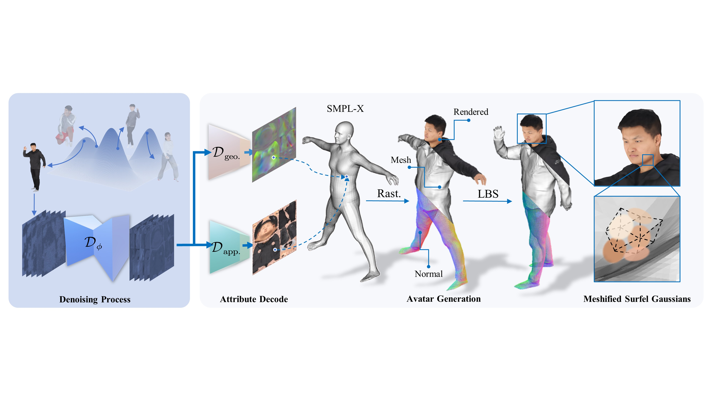
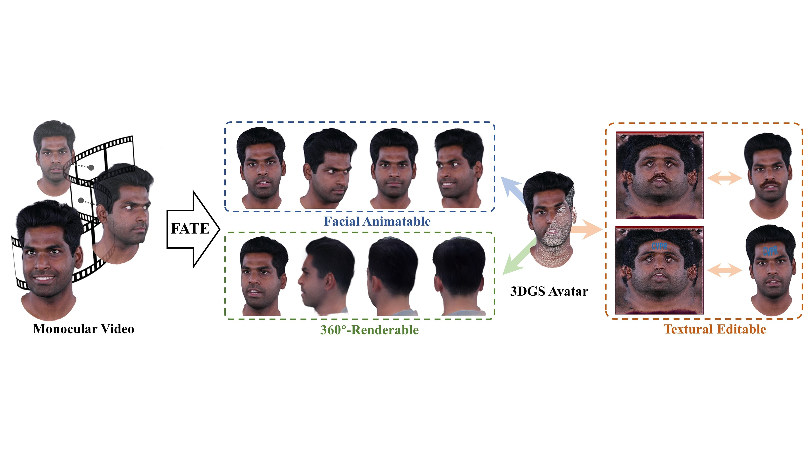

About me
======
I'm a first-year master's student in NJU-3DV, supervised by [Prof. Hao Zhu](http://zhuhao.cc/home/) and [Prof. Xun Cao](https://cite.nju.edu.cn/People/Faculty/20190621/i5054.html). My research interests include avatar modeling, generative model, neural rendering, 3D computer vision. I obtained my Bachelor’s degree in Electronic Information Science and Technology from [Nanjing University](https://www.nju.edu.cn/en/).

Publications
======

  
  

    <strong>SurfAvatar: Versatile Human Avatar with Meshified Surfel Gaussians</strong> 
    <strong>Zijian Wu</strong>, Jiawei Zhang, Yanwen Wang, Yao Yao, Siyu Zhu, Xun Cao, Hao Zhu 
    <strong>In submission to ICCV 2025</strong> 
    <a href="https://zijian-wu.github.io/files/SurfAvatar.pdf">[paper]</a>
    <!-- <a href="https://github.com/zjwfufu/FateAvatar">[code]</a>
    <a href="https://zjwfufu.github.io/FATE-page/">[homepage]</a> -->
  

  
  

    <strong>FATE: Full-head Gaussian Avatar with Textual Editing from Monocular Video</strong> 
    Jiawei Zhang, <strong>Zijian Wu</strong>, Zhiyang Liang, Yicheng Gong, Dongfang Hu, Yao Yao, Xun Cao, Hao Zhu 
    <strong>CVPR 2025</strong> 
    <a href="https://arxiv.org/abs/2411.15604">[paper]</a>
    <a href="https://github.com/zjwfufu/FateAvatar">[code]</a>
    <a href="https://zjwfufu.github.io/FATE-page/">[homepage]</a>
  

